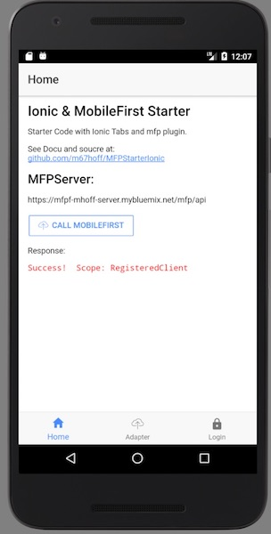
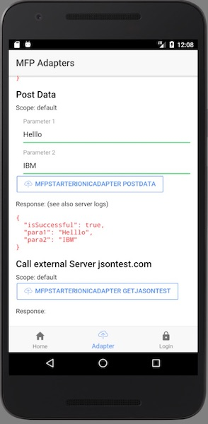
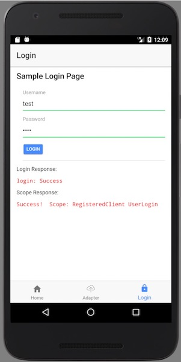

This is a starter template for [IBM MobleFirst](https://mobilefirstplatform.ibmcloud.com/tutorials/en/foundation/8.0/cordova-tutorials/) and [Ionic (V3 typescript)](http://ionicframework.com/docs/) projects.

## How to use this template

[](https://greenkeeper.io/)
[](https://travis-ci.org/m67hoff/MFPStarterIonic)

*You can run this mobile app without installing your own MobileFirst DevelomentKit/Server by using my demo-mfpserver on Bluemix (this may change in the future)*. **However, is recommended to install your own server locally using the FREE MobileFirst Developer Kit**

See [MobileFirst Developer Kit - Installation guide](https://mobilefirstplatform.ibmcloud.com/tutorials/en/foundation/8.0/installation-configuration/development/mobilefirst/)  


### Prereq 

You need some basic [Ionic](http://ionicframework.com/docs/) knowledge and the ionic cli installed.

Also Android Stuido (or Xcode on Mac) is needed for the device emulators

```bash
npm install -g ionic cordova
```

clone the repository, cd into the folder and run: 

```bash
ionic cordova build android 
```
for ios: 

```bash
ionic cordova build ios 
```

cordova build/run automatically install the needed npm packages and cordova plugins.
if you prefer to do this step by step use:

```bash
npm install #install npm modules 
cordova prepare #install plugins in config.xml
ionic cordova build <platform>
```


### Todo

- extend docu

### Changelog

- 20170612 - first public Version
- 20170630 - update mfp / cordova 7 support
- 20170703 - update to ionic 3.5 
- 20170704 - extended login choice to set LoginPage as auth callback challange
- 20170707 - check-in resources (since generate needs an ionic login) 
- 20170711 - add POST data sample / add UserLogin adapter source 
 
---
#### Screenshot




